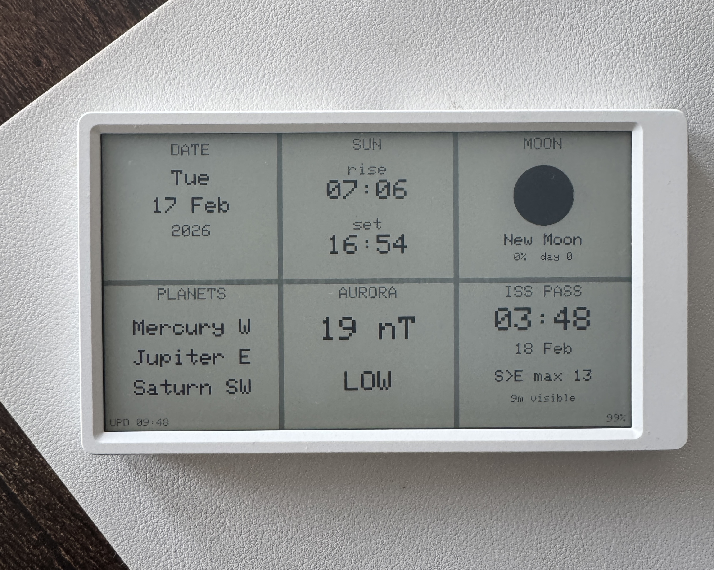

# M5Paper Astronomy Dashboard

An e-ink astronomy dashboard for the [M5Paper](https://docs.m5stack.com/en/core/m5paper_v1.1) that shows what's happening in the sky above London. Refreshes every 30 minutes, runs for ~12 weeks on battery.

A Raspberry Pi computes astronomy data (using [PyEphem](https://rhodesmill.org/pyephem/)) and fetches aurora/ISS info, then serves a small JSON file over your local network. The M5Paper wakes up, grabs the JSON, draws the dashboard, and goes back to sleep.

```
Celestrak TLE ──► Raspberry Pi (cron + HTTP server) ──► WiFi ──► M5Paper (e-ink)
AuroraWatch API ─┘
```

## What it shows



- **Date** — weekday, day month, year (from RTC, synced via NTP)
- **Sun** — sunrise and sunset times for London
- **Moon** — phase disc visualisation, phase name, illumination %, day of cycle
- **Planets** — naked-eye planets visible tonight with compass direction
- **Aurora** — AuroraWatch UK magnetometer reading (nT) and activity level
- **ISS Pass** — next visible pass: time, date, direction, max altitude, duration
- **Updated / Battery** — small corner inlays at the bottom

## Data sources

| Tile | Source | API needed? |
|------|--------|-------------|
| Sun | Simplified solar equations for London (51.5°N, 0.1°W) | No |
| Moon | Phase calculation from known new moon reference | No |
| Planets | [PyEphem](https://rhodesmill.org/pyephem/) — positions of Mercury, Venus, Mars, Jupiter, Saturn | No |
| Aurora | [AuroraWatch UK API](https://aurorawatch.lancs.ac.uk/api-info/) (Lancaster University) | No (free, no key) |
| ISS | [Celestrak TLE](https://celestrak.org/) + PyEphem pass prediction | No (free, no key) |

No API keys required — all data sources are free and open.

## Hardware

### M5Paper v1.1

| Component | Spec |
|-----------|------|
| MCU | ESP32-D0WDQ6-V3, 240 MHz dual-core, 16 MB flash, 8 MB PSRAM |
| Display | 4.7" e-ink, 960×540, 16 grayscale levels, IT8951 controller |
| Battery | 1150 mAh LiPo, USB-C charging |
| WiFi | 2.4 GHz only (ESP32 hardware limitation) |
| Sleep draw | ~10 µA (only RTC on) |

The e-ink display retains its image with zero power — like printed paper. The device is fully off between refreshes; only the RTC ticks to trigger the next wake.

### Raspberry Pi

Any Pi that can run Python and stay on your network. Serves the dashboard JSON over HTTP on port 8081.

## Setup

### 1. Clone & configure

```bash
git clone https://github.com/12ian34/m5paper-dash-astro.git
cd m5paper-dash-astro
cp .env.example .env
```

Edit `.env` with your details:

```
WIFI_SSID=your_wifi_ssid
WIFI_PASS=your_wifi_password
DASHBOARD_URL=http://your-pi-ip:8081/dashboard.json
```

### 2. Set up the Pi

Copy the server files to your Pi:

```bash
scp server/update_dashboard.py server/serve.py server/setup_cron.sh server/requirements.txt user@your-pi:~/m5-astro/server/
scp .env user@your-pi:~/m5-astro/
```

On the Pi, set up the venv and cron jobs:

```bash
cd ~/m5-astro/server
python3 -m venv .venv
.venv/bin/pip install -r requirements.txt
bash setup_cron.sh
```

This installs two cron jobs:
- **Every 30 min** (`14,44 * * * *`): computes astronomy data and writes `dashboard.json`
- **On boot** (`@reboot`): starts the HTTP server on port 8081

### 3. Build & flash the firmware

You need [PlatformIO](https://platformio.org/install) and a Python venv:

```bash
python3 -m venv .venv
source .venv/bin/activate
pip install platformio
```

Connect the M5Paper via USB-C, then:

```bash
cd firmware
pio run -t upload
```

PlatformIO will auto-detect the serial port. If you have multiple serial devices, create `firmware/platformio_override.ini`:

```ini
[env:m5paper]
upload_port = /dev/cu.usbserial-XXXXX
monitor_port = /dev/cu.usbserial-XXXXX
```

### 4. First boot

Once flashed, the M5Paper will:

1. Show "BOOTING..."
2. Connect to WiFi
3. Fetch `dashboard.json` from the Pi
4. Draw the dashboard
5. Sync the RTC via NTP
6. Shut down and set a 30-minute wake alarm

It repeats this cycle indefinitely. Press the **rear reset button** for an immediate refresh.

## How it works

### M5Paper lifecycle

The device is fully powered off between refreshes. Each cycle:

1. **RTC alarm fires** → cold boot
2. WiFi connect (~2-3s)
3. HTTP GET to Pi (~1s)
4. Parse JSON, draw dashboard
5. NTP time sync (runs *after* draw — NTP can hang on battery)
6. `M5.shutdown()` → sets next alarm, cuts power
7. E-ink retains image with zero power

**Total awake time: ~5-10 seconds per cycle.**

On USB power, `M5.shutdown()` can't fully cut power (USB keeps the ESP32 alive). The firmware handles this by calling `ESP.restart()` after the refresh interval elapses.

### Pi side

`update_dashboard.py` runs every 30 minutes via cron:

1. Computes sunrise/sunset using simplified solar equations for London
2. Computes moon phase from a known new moon reference date
3. Uses PyEphem to calculate which naked-eye planets are above the horizon 1 hour after sunset
4. Fetches current geomagnetic activity from the AuroraWatch UK API
5. Fetches ISS TLE from Celestrak (cached 24h), computes the next visible pass using PyEphem
6. Writes `dashboard.json`

`serve.py` is a threaded HTTP server that serves the JSON file. It uses `ThreadingTCPServer` because Python's built-in `http.server` is single-threaded and hangs when the ESP32 makes incomplete connections.

### Planet visibility

Planets are computed for 1 hour after the next sunset — the best general viewing time. A planet is shown if its altitude is above 5°. The compass direction (N, NE, E, SE, S, SW, W, NW) tells you where to look.

### ISS pass prediction

A pass is considered "visible" when:
- Max altitude > 10° (high enough to see easily)
- Sun is below -6° (civil twilight — dark enough to see the sunlit ISS)

The script searches up to 50 passes to find the next one meeting both criteria.

### Aurora thresholds

AuroraWatch UK measures geomagnetic disturbance in nanotesla (nT):

| Level | nT range | Meaning |
|-------|----------|---------|
| LOW | < 50 | No significant activity |
| MINOR | 50–100 | Minor geomagnetic activity |
| MODERATE | 100–200 | Possible aurora from Scotland/N. England |
| HIGH | > 200 | Aurora likely visible from the UK |

## Battery life

| Parameter | Value |
|-----------|-------|
| Battery capacity | 1150 mAh |
| Sleep draw | ~10 µA |
| Wake cycle | ~120 mA for ~8s = ~0.27 mAh |
| Refresh interval | 30 minutes |
| Daily consumption | ~14 mAh |
| **Estimated battery life** | **~80 days / ~12 weeks** |

## Project structure

```
├── firmware/
│   ├── src/main.cpp           # M5Paper firmware (Arduino/ESP32)
│   ├── platformio.ini         # PlatformIO config
│   └── load_env.py            # Build script: injects .env as compiler flags
├── server/
│   ├── update_dashboard.py    # Computes astronomy data, writes dashboard.json
│   ├── serve.py               # Threaded HTTP file server
│   ├── setup_cron.sh          # Installs cron jobs on the Pi
│   └── requirements.txt       # Python dependencies (httpx, python-dotenv, ephem)
├── .env.example               # Template for required environment variables
└── README.md
```

## Customisation

### Different location

The sun/moon calculations and London coordinates are in `server/update_dashboard.py`. Change `LONDON_LAT`, `LONDON_LON`, and `LONDON_ELEV` to your location. The BST timezone logic in `uk_offset()` would also need updating for non-UK locations.

### Different port

The default HTTP port is 8081 (to coexist with other services). Change it in `setup_cron.sh`, `serve.py`, and your `.env` `DASHBOARD_URL`.

## Troubleshooting

**M5Paper shows "WiFi Failed"**
- Check your SSID/password in `.env`
- Must be a 2.4 GHz network (ESP32 doesn't support 5 GHz)
- Device will retry on the next 30-minute cycle

**M5Paper shows "HTTP -1" or similar**
- Check the Pi is running: `curl http://your-pi-ip:8081/dashboard.json`
- Verify `DASHBOARD_URL` in `.env` matches the Pi's IP
- Ensure the M5Paper and Pi are on the same network

**Planets tile shows "None tonight"**
- Normal if no naked-eye planets are above the horizon after sunset
- Seasonal — some months have fewer visible planets

**ISS tile shows "No visible pass soon"**
- The ISS isn't always visible from every location
- Passes must occur during twilight (so the ISS is sunlit but the sky is dark)
- A new pass will appear within a few days

**Screen stays on "Fetching dashboard..."**
- If on battery: ensure you're running the latest firmware (NTP runs after draw to avoid blocking)

**Serial port not found during flash**
- Run `ls /dev/cu.usb*` to find your device
- Create `firmware/platformio_override.ini` with the correct port
- Try a different USB-C cable (some are charge-only)

## Notes

- Uses `M5.shutdown()` for sleep, NOT ESP32 deep sleep — deep sleep is unreliable on M5Paper
- Board is `m5stack-fire` in PlatformIO (no official M5Paper board definition)
- The M5Paper and Pi don't need to be time-synced — the Pi writes JSON on its own schedule, the M5Paper grabs whatever is there
- The `setup_cron.sh` script preserves existing cron jobs when adding new ones
